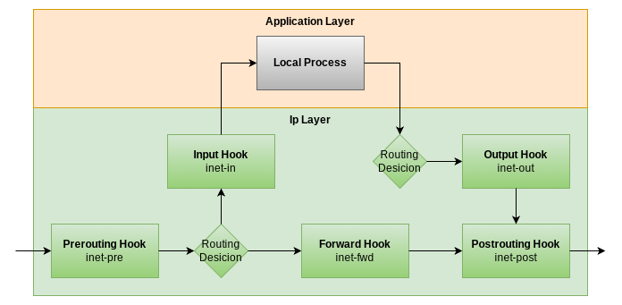

# Firewall Role

<!-- cSpell:ignore inet, igmp, icmpv6, ruleset, dport, Netfilter -->

The role installs `nftables` and sets up basic extensible nftables chains and rules, provides `Revalidate and reload nftables` and `Reload nftables` handlers.

## Default Firewall Rules

Current nftables hooks used:



_Inspired by the image [nftables wiki: Netfilter hooks](https://wiki.nftables.org/wiki-nftables/index.php/Netfilter_hooks)._

- Each rule has counter set
- When `nftables_log_rejected` is defined and true, all rejected packets are logged in the syslog prefixed `nftables` _`chain`_ `rejected`, default is false, see [Rejected Packets Logging](#rejected-packets-logging)
- `inet-pre`
  - Drops invalid packets and packets for localhost originating out of the loopback interface
  - Accepts the rest
- `inet-in`
  - Accepts established, related, and loopback traffic
  - Accepts and **rate limits** icmp, igmp, and icmpv6 packets
  - Accepts TCP SSH
  - Includes `/etc/nftables/inet-in-*.conf` extension rules, see [Extending The Firewall](#extending-the-firewall)
  - Rejects the rest
  - Sets rejected packets logging to syslog when Ansible variable `nftables_log_rejected` is defined and true with prefix `nftables inet-in rejected`
- `inet-fwd`
  - Accepts established, related traffic
  - Accepts icmp, igmp, and icmpv6 packets
  - Includes `/etc/nftables/inet-fwd-*.conf` extension rules, see [Extending The Firewall](#extending-the-firewall)
  - Rejects the rest
  - Sets rejected packets logging to syslog when Ansible variable `nftables_log_rejected` is defined and true with prefix `nftables inet-fwd rejected`
- `inet-out`
  - Accepts established, related, and loopback traffic
  - Accepts icmp, igmp, and icmpv6 packets
  - Accepts UDP and TCP DNS
  - Accepts UDP NTP
  - Accepts TCP SSH, HTTP, HTTPS
  - Includes `/etc/nftables/inet-out-*.conf` extension rules, see [Extending The Firewall](#extending-the-firewall)
  - Rejects the rest
  - Sets rejected packets logging to syslog when Ansible variable `nftables_log_rejected` is defined and true with prefix `nftables inet-out rejected`
- `inet-post`
  - Drops invalid packets and packets for localhost ending out of the loopback interface
  - Accepts the rest
- Includes `/etc/nftables/inet-chain-*.conf` extension chains, see [Extending The Firewall](#extending-the-firewall)

### Rejected Packets Logging

Example of `inventory.yml` defining `nftables_log_rejected` and setting it true:

```yaml
all:
# ...

# In an inventory group or for a machine:
  vars:
    nftables_log_rejected: true
```

Example of using live tail:

```shell
sudo tail -f /var/log/syslog | grep 'nftables inet-in rejected'
```

## Firewall Commands

With installed `xebis.ansible.firewall` role:

```shell
sudo nft flush ruleset # Flush all rules

sudo /etc/nftables.conf # Reload all rules

sudo watch -d -n 1 'nft list ruleset | grep counter\.*rejected' # Watch rejected packets and bytes counters
```

## Extending The Firewall

### Temporary Rules and Chains

Example:

```shell
sudo nft insert rule inet filter inet-out tcp dport 8080 accept
```

To get rid of temporary rules and chains run `sudo /etc/nftables.conf`, or reload nftables service, reboot, etc.

### Permanent Rules and Chains

To extend rules and chains in a hook:

1. Put nftables files to `/etc/nftables/` directory, the file naming convention:
    - `hook-name.conf`, only `inet-in`, `inet-fwd`, and `inet-out` are currently processed
    - `chain-name.conf`, only `inet-chain` is currently processed
2. Revalidate and reload nftables ruleset
    - manually by the `sudo nft -c -f /etc/nftables.conf && sudo /etc/nftables.conf` command
    - in an Ansible role by calling `Revalidate and reload nftables` handler

#### Example of Rules Extension

In `inet-in-my-app.conf`:

```nft
tcp dport 8080 counter accept # Allow testing HTTP traffic
```

#### Example of Using a Chain

The rules file should point traffic to a chain in `inet-in-my-app.conf`:

```nft
tcp dport { 2000,3000,8080 } jump inet-in-my-app # Jump to the my-app chain
```

The `inet-chain-my-app.conf` chain file should contain the chain:

```nft
chain inet-in-my-app {
    tcp dport 2000 counter accept # Allow BE testing HTTP traffic
    tcp dport 3000 counter accept # Allow API testing HTTP traffic
    tcp dport 8080 counter accept # Allow FE testing HTTP traffic
}
```

#### Example of Use in a Role

Add a role dependency in `meta` file:

```yaml
---
dependencies:
  - role: xebis.ansible.firewall # Expects extensible firewall in place
```

Create rules and chain files, for example `inet-in-role.conf` and `inet-out-role.conf`.

Add Ansible task to copy files to `/etc/nftables` and reload firewall rules, for example:

```yaml
- name: Copy role firewall rules
  become: true
  ansible.builtin.copy:
    src: "{{ item }}"
    dest: /etc/nftables/{{ item }}
    mode: u=rw,g=r,o=r
  with_items:
    - inet-in-role.conf
    - inet-out-role.conf
  notify: Revalidate and reload nftables
```

## References

- [nftables wiki: Netfilter hooks](https://wiki.nftables.org/wiki-nftables/index.php/Netfilter_hooks)
